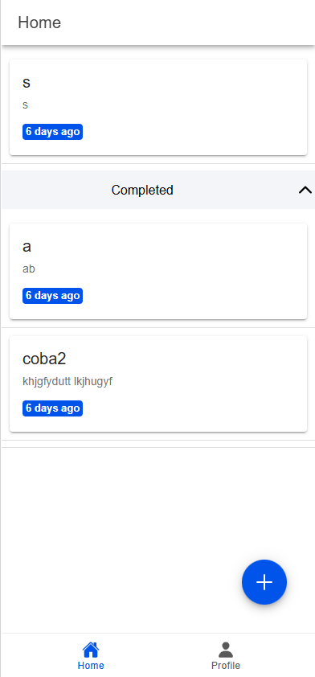
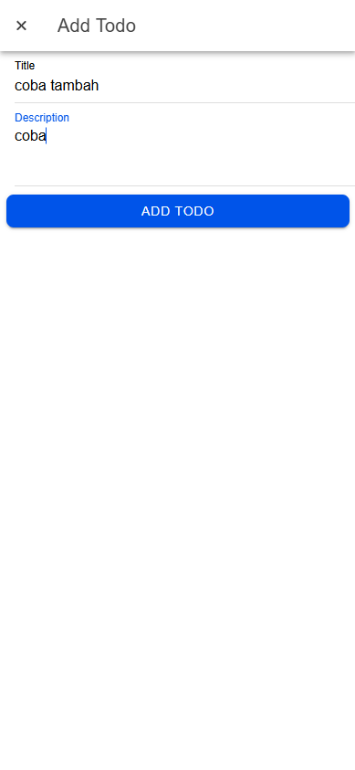
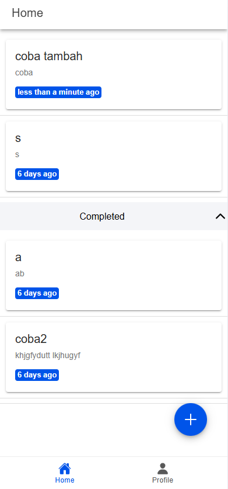
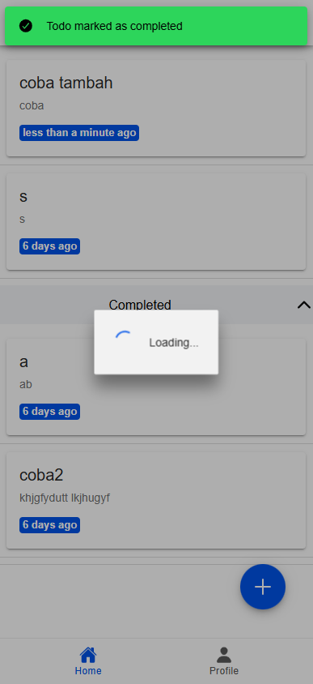
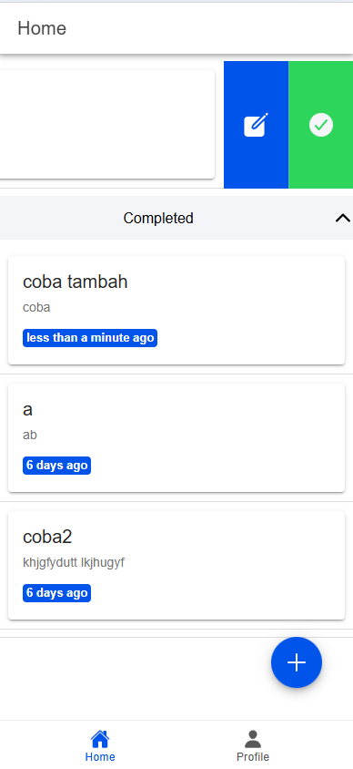
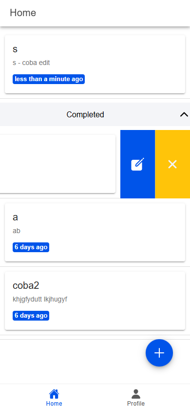
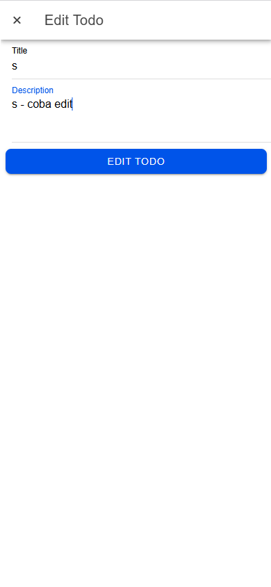
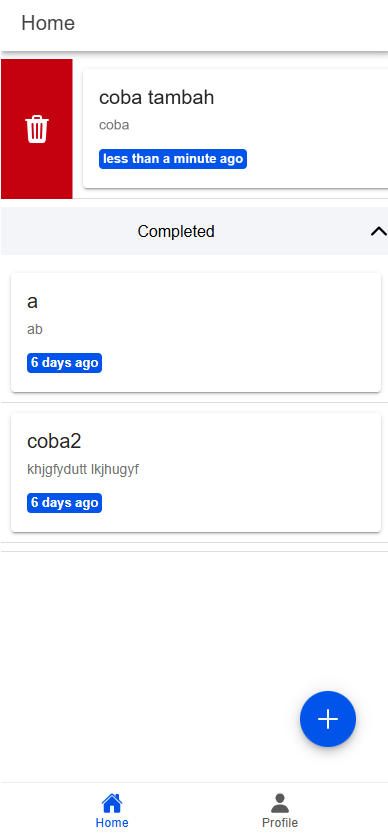
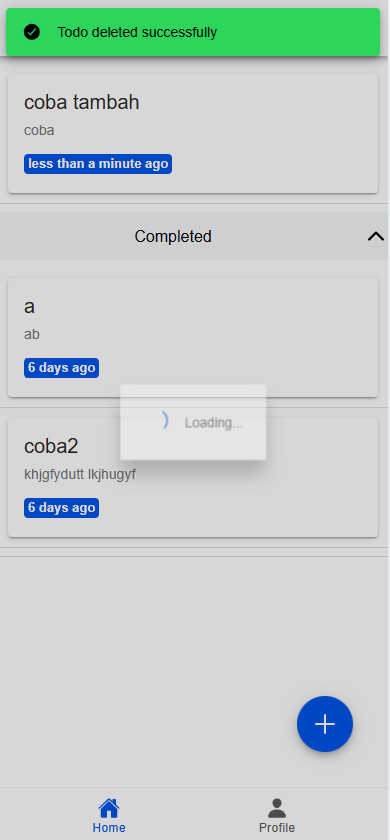

# Tugas 10 - Pertemuan 11

**Nama**  : Eka Belandini  
**NIM**   : H1D022002  
**Shift** : F  

## Deskripsi Proyek

Aplikasi ini adalah aplikasi manajemen tugas (Todo) berbasis **Ionic**, **Vue.js**, dan **Firebase Firestore**. Pengguna dapat login menggunakan Google, mengelola tugas melalui CRUD, serta menandai tugas selesai atau aktif. Aplikasi ini juga dapat dibangun menjadi APK secara langsung dari **VS Code tanpa Android Studio**, cukup dengan Android SDK.

---

## Fitur Utama

- **Autentikasi Google**: Login menggunakan akun Google.
- **CRUD Tugas**: Menambahkan, membaca, mengedit, dan menghapus tugas.
- **Penandaan Status**: Menandai tugas sebagai selesai atau aktif.

---

## Demo Aplikasi

### Screenshot CRUD

#### **1. Halaman Awal**


- Pada awalnya, berikut daftar tugas sebelum ada data baru yang dimasukkan.

---

#### **2. Menambahkan Tugas**


- Pengguna dapat menambahkan tugas baru dengan memasukkan judul dan deskripsi.

---

#### **3. Daftar Tugas Setelah Tugas Ditambahkan**


- Setelah tugas berhasil ditambahkan, daftar tugas akan diperbarui dan menampilkan tugas baru.

---

#### **4. Menandai Tugas Sebagai Selesai**


- Pengguna dapat menandai tugas sebagai selesai, yang akan memindahkan tugas tersebut ke bagian tugas selesai.

---

#### **5. Mengedit Tugas**




- Untuk mengubah tugas, pengguna dapat menggunakan tombol edit yang tersedia.

---

#### **6. Menghapus Tugas**



- Pengguna dapat menghapus tugas dengan tombol hapus. Setelah tugas dihapus, daftar tugas diperbarui.

---

## Langkah-Langkah Membangun APK

### **1. Persiapan Awal**
1. **Pastikan Anda Telah Menginstal**:
   - **Node.js** dan **npm**: Untuk mengelola dependensi.
   - **Ionic CLI**:  
     Instal dengan perintah:  
     ```bash
     npm install -g @ionic/cli
     ```
   - **Capacitor CLI**:  
     Instal dengan perintah:  
     ```bash
     npm install @capacitor/core @capacitor/android
     ```
   - **Java Development Kit (JDK)**: Download di [Oracle JDK](https://www.oracle.com/java/technologies/javase-downloads.html).
   - **Android Command-Line Tools**: Download di [Android Command-Line Tools](https://developer.android.com/studio#command-tools).

2. **Tambahkan PATH ke Sistem**:
   Tambahkan direktori Android SDK ke PATH. Contoh:
   ```bash
   export ANDROID_HOME=~/Android/Sdk
   export PATH=$PATH:$ANDROID_HOME/tools:$ANDROID_HOME/platform-tools
   ```

3. **Pastikan SDK Manager Berfungsi**:
   Verifikasi dengan menjalankan:
   ```bash
   sdkmanager --list
   ```

---

### **2. Menyiapkan Proyek Ionic**
1. **Buka Proyek di VS Code**:
   Navigasikan ke folder proyek Anda di terminal.

2. **Build Aplikasi Ionic**:
   ```bash
   ionic build
   ```
   Folder `www` akan dibuat, berisi file aplikasi.

3. **Integrasikan Dengan Capacitor**:
   ```bash
   ionic capacitor add android
   ionic capacitor sync android
   ```

---

### **3. Membuat APK**
1. **Navigasi ke Folder Android**:
   ```bash
   cd android
   ```

2. **Build APK Debug**:
   ```bash
   ./gradlew assembleDebug
   ```
   - APK akan tersedia di:
     ```
     android/app/build/outputs/apk/debug/app-debug.apk
     ```

3. **Build APK Release**:
   ```bash
   ./gradlew assembleRelease
   ```
   - APK akan tersedia di:
     ```
     android/app/build/outputs/apk/release/app-release.apk
     ```

---

### **4. Instal APK ke HP**
1. **Salin APK**:  
   Gunakan kabel USB, aplikasi berbagi file (Google Drive), atau aplikasi pengelola file.

2. **Instal APK**:  
   - Aktifkan **Sumber Tidak Dikenal** di pengaturan keamanan HP.
   - Pilih file APK di perangkat Anda dan instal.

---

### Screenshot Proses Pembuatan APK dan Instalasi

#### **1. Build APK Debug**


- Build menggunakan Gradle berhasil, menghasilkan file `app-debug.apk`.

---

#### **2. APK Dipindahkan ke Perangkat**


- APK dipindahkan ke perangkat melalui kabel USB.

---

#### **3. Instalasi di HP**


- File APK berhasil diinstal, dan aplikasi siap digunakan di perangkat.

---
